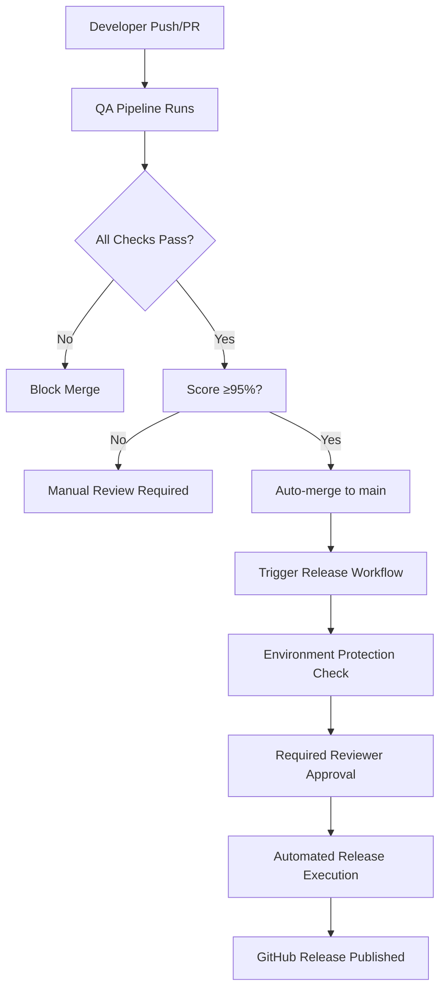

# Branch Protection Rules for Automated Releases

This document outlines the recommended GitHub branch protection rules to ensure safe automated releases.

## Main Branch Protection Rules

Configure the following settings for the `main` branch in GitHub repository settings:

### Required Settings

1. **Protect matching branches** ✅
   - Branch name pattern: `main`

2. **Require a pull request before merging** ✅
   - Required number of reviewers: `1`
   - Dismiss stale PR approvals when new commits are pushed: ✅
   - Require review from code owners: ✅

3. **Require status checks to pass before merging** ✅
   Required status checks:
   - `Code Quality Analysis`
   - `Unit Tests`
   - `Integration Tests` 
   - `Performance Tests`
   - `Release Readiness Assessment`

4. **Require conversation resolution before merging** ✅

5. **Require signed commits** ⚠️ (Optional but recommended)

6. **Require linear history** ⚠️ (Optional - helps with clean git history)

7. **Allow force pushes** ❌ (Disabled)

8. **Allow deletions** ❌ (Disabled)

## Release Branch Protection Rules

Configure the following for `release/*` branches:

### Required Settings

1. **Protect matching branches** ✅
   - Branch name pattern: `release/*`

2. **Require status checks to pass before merging** ✅
   Required status checks:
   - `Code Quality Analysis`
   - `Unit Tests` 
   - `Integration Tests`
   - `Performance Tests`
   - `Release Readiness Assessment`

3. **Restrict pushes that create release branches** ✅
   - Only release managers and administrators

## Environment Protection Rules

Configure production environment protection:

### Production Environment Settings

1. **Environment name:** `production`

2. **Required reviewers** ✅
   - Add release managers/team leads
   - Require at least 1 reviewer

3. **Wait timer** ⚠️ (Optional)
   - Consider 5-10 minute delay for final checks

4. **Deployment branches** ✅
   - Selected branches only: `main`, `release/*`

## Automated Release Flow

With these protection rules, the automated release flow works as follows:



## GitHub CLI Configuration Commands

Run these commands to set up branch protection via GitHub CLI:

```bash
# Set up main branch protection
gh api repos/:owner/:repo/branches/main/protection \
  --method PUT \
  --field required_status_checks='{"strict":true,"contexts":["Code Quality Analysis","Unit Tests","Integration Tests","Performance Tests","Release Readiness Assessment"]}' \
  --field enforce_admins=true \
  --field required_pull_request_reviews='{"required_approving_review_count":1,"dismiss_stale_reviews":true,"require_code_owner_reviews":true}' \
  --field restrictions=null

# Set up release branch protection  
gh api repos/:owner/:repo/branches/release%2F*/protection \
  --method PUT \
  --field required_status_checks='{"strict":true,"contexts":["Code Quality Analysis","Unit Tests","Integration Tests","Performance Tests"]}' \
  --field enforce_admins=true \
  --field required_pull_request_reviews='{"required_approving_review_count":1}' \
  --field restrictions='{"users":[],"teams":["release-managers"],"apps":[]}'

# Create production environment
gh api repos/:owner/:repo/environments/production \
  --method PUT \
  --field wait_timer=300 \
  --field reviewers='[{"type":"Team","id":TEAM_ID}]' \
  --field deployment_branch_policy='{"protected_branches":true,"custom_branch_policies":false}'
```

## Required GitHub Secrets

Ensure these secrets are configured in repository settings:

### Repository Secrets

- `GITHUB_TOKEN` (automatically provided)

### Optional Secrets for Enhanced Notifications

- `SLACK_WEBHOOK_URL` - For Slack release notifications
- `DISCORD_WEBHOOK_URL` - For Discord notifications  
- `EMAIL_SMTP_HOST` - For email notifications
- `EMAIL_SMTP_USER` - Email username
- `EMAIL_SMTP_PASSWORD` - Email password

## Monitoring and Alerts

Set up monitoring for the automated release pipeline:

### GitHub Actions Monitoring

1. **Workflow failure notifications** ✅
   - Enable in repository notification settings
   - Configure for release-critical workflows

2. **Performance degradation alerts** ⚠️
   - Monitor workflow execution times
   - Alert if release pipeline takes >30 minutes

### Release Health Monitoring

1. **Post-release health checks** ✅
   - Automated via release workflow
   - Manual verification checklist

2. **Rollback procedures** ✅
   - Documented in release notes
   - Automated rollback triggers

## Security Considerations

### Supply Chain Security

1. **Dependency scanning** ✅ (via Dependabot)
2. **Code scanning** ✅ (via CodeQL)
3. **Secret scanning** ✅ (GitHub Advanced Security)

### Release Artifact Security

1. **Signed releases** ⚠️ (Consider implementing)
2. **Checksum verification** ✅ (in QA bundle)
3. **Audit logging** ✅ (GitHub audit log)

## Troubleshooting

### Common Issues

1. **Status checks not appearing**
   - Ensure workflow names exactly match protection rules
   - Check workflow triggers include target branches

2. **Environment approval stuck**
   - Verify reviewers have repository access
   - Check environment reviewer configuration

3. **Release workflow fails**
   - Verify GITHUB_TOKEN has sufficient permissions
   - Check QA bundle generation completed successfully

### Emergency Procedures

1. **Bypass protection for hotfixes**
   - Use GitHub admin override (logged)
   - Temporary disable protection rules
   - Re-enable immediately after hotfix

2. **Manual release fallback**
   - Use `scripts/auto_release.sh` locally
   - Upload artifacts manually to GitHub releases
   - Document deviation in release notes

---

*Configure these settings in GitHub repository settings → Branches and Environments*