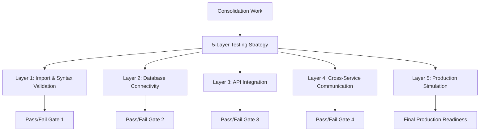

# 🧪 Signal Service Consolidation Test Plan

## Overview
Comprehensive 5-layer testing strategy to validate signal service consolidation work, ensuring all cross-references are resolved and production readiness.

## Testing Strategy



## Layer 1: Import & Syntax Validation

### test_consolidation_imports.py
```python
import pytest
import importlib
import sys
from pathlib import Path

def test_all_imports_resolve():
    """Test that all imports in the consolidated codebase resolve correctly"""
    
    signal_service_root = Path("signal_service")
    python_files = list(signal_service_root.glob("**/*.py"))
    
    failed_imports = []
    
    for py_file in python_files:
        try:
            # Convert file path to module path
            module_path = str(py_file).replace("/", ".").replace(".py", "")
            importlib.import_module(module_path)
            print(f"✅ {module_path}")
        except Exception as e:
            failed_imports.append((module_path, str(e)))
            print(f"❌ {module_path}: {e}")
    
    assert len(failed_imports) == 0, f"Failed imports: {failed_imports}"

def test_circular_imports():
    """Detect circular import dependencies"""
    # Implementation to detect circular imports
    pass

def test_missing_dependencies():
    """Test for missing external dependencies"""
    required_packages = [
        "httpx", "pandas", "numpy", "fastapi", 
        "asyncpg", "redis", "smartmoneyconcepts", "py_vollib"
    ]
    
    for package in required_packages:
        try:
            importlib.import_module(package)
            print(f"✅ {package} available")
        except ImportError:
            pytest.fail(f"❌ Missing required package: {package}")

def test_configuration_loading():
    """Test that all configuration files load correctly"""
    from signal_service.app.core.config import settings
    
    # Test config service connection
    assert settings.CONFIG_SERVICE_URL is not None
    assert settings.DATABASE_URL is not None
    assert settings.REDIS_URL is not None
```

## Layer 2: Database Connectivity Testing

### test_database_integration.py
```python
import pytest
import asyncio
from signal_service.app.repositories.signal_repository import SignalRepository
from signal_service.app.utils.db import get_timescaledb_session

@pytest.mark.asyncio
async def test_database_connection():
    """Test database connection establishment"""
    try:
        db_session = await get_timescaledb_session()
        assert db_session is not None
        print("✅ Database connection successful")
    except Exception as e:
        pytest.fail(f"❌ Database connection failed: {e}")

@pytest.mark.asyncio
async def test_signal_repository_operations():
    """Test all repository operations work"""
    repo = SignalRepository()
    await repo.initialize()
    
    # Test basic operations
    latest_greeks = await repo.get_latest_greeks("TEST_INSTRUMENT")
    print(f"✅ Repository query successful: {latest_greeks}")

@pytest.mark.asyncio
async def test_database_schema_exists():
    """Verify required database tables exist"""
    required_tables = [
        "signal_greeks", "signal_indicators", 
        "signal_custom_timeframes", "marketplace.indicator_products"
    ]
    
    db_session = await get_timescaledb_session()
    async with db_session.acquire() as conn:
        for table in required_tables:
            result = await conn.fetchval(
                "SELECT EXISTS (SELECT 1 FROM information_schema.tables WHERE table_name = $1)",
                table.split(".")[-1]  # Get table name without schema
            )
            assert result, f"❌ Missing table: {table}"
            print(f"✅ Table exists: {table}")

@pytest.mark.asyncio
async def test_greeks_crud_operations():
    """Test full CRUD operations for Greeks data"""
    repo = SignalRepository()
    await repo.initialize()
    
    # Create test data
    test_greeks = {
        "signal_id": "test_123",
        "instrument_key": "NIFTY_TEST",
        "delta": 0.5,
        "gamma": 0.01,
        # ... other fields
    }
    
    # Test INSERT
    record_id = await repo.save_greeks(test_greeks)
    assert record_id is not None
    print(f"✅ Greeks INSERT successful: ID {record_id}")
    
    # Test SELECT
    retrieved = await repo.get_latest_greeks("NIFTY_TEST")
    assert retrieved is not None
    assert retrieved["delta"] == 0.5
    print(f"✅ Greeks SELECT successful")
    
    # Cleanup
    await repo._cleanup_test_data(record_id)
```

## Layer 3: API Integration Testing

### test_http_integration.py
```python
import pytest
import httpx
from signal_service.app.integrations.subscription_service_client import SignalSubscriptionClient
from signal_service.app.services.marketplace_client import MarketplaceClient

@pytest.mark.asyncio
async def test_subscription_service_client():
    """Test real HTTP client operations"""
    client = SignalSubscriptionClient()
    
    try:
        # Test with mock/staging endpoints
        result = await client.validate_user_access("test_user", "basic_signals")
        print(f"✅ Subscription client working: {result}")
    except Exception as e:
        print(f"⚠️  Subscription service not available (expected in test): {e}")

@pytest.mark.asyncio
async def test_marketplace_client():
    """Test marketplace HTTP client"""
    async with MarketplaceClient() as client:
        try:
            health = await client.health_check()
            print(f"✅ Marketplace client working: {health}")
        except Exception as e:
            print(f"⚠️  Marketplace service not available (expected in test): {e}")

def test_http_client_configuration():
    """Test HTTP client configuration is correct"""
    client = SignalSubscriptionClient()
    assert client.base_url is not None
    assert client.timeout > 0
    print("✅ HTTP client configuration valid")

@pytest.mark.asyncio
async def test_api_endpoints_respond():
    """Test all API endpoints are reachable"""
    from fastapi.testclient import TestClient
    from signal_service.app.main import app
    
    client = TestClient(app)
    
    # Test core endpoints
    endpoints_to_test = [
        "/health",
        "/api/v2/signals/process-tick",
        "/api/v2/signals/realtime/greeks/NIFTY",
        "/api/v2/signals/fo/premium-analysis/performance-metrics"
    ]
    
    for endpoint in endpoints_to_test:
        try:
            response = client.get(endpoint) if "GET" in endpoint else client.post(endpoint, json={})
            print(f"✅ {endpoint}: HTTP {response.status_code}")
        except Exception as e:
            print(f"❌ {endpoint}: {e}")
```

## Layer 4: Cross-Service Communication Testing

### test_cross_service_integration.py
```python
@pytest.mark.asyncio
async def test_signal_to_marketplace_flow():
    """Test complete signal service to marketplace flow"""
    from signal_service.app.services.signal_processor import SignalProcessor
    from signal_service.app.services.marketplace_client import MarketplaceClient
    
    # Test signal generation → marketplace notification flow
    processor = SignalProcessor()
    await processor.initialize()
    
    # Simulate signal processing
    test_tick = {
        "instrument_key": "NIFTY",
        "last_price": 21500.0,
        "timestamp": "2026-01-12T12:00:00Z"
    }
    
    try:
        result = await processor.process_tick(test_tick)
        print(f"✅ Signal processing successful: {result}")
    except Exception as e:
        print(f"❌ Signal processing failed: {e}")

def test_redis_integration():
    """Test Redis connectivity and operations"""
    from signal_service.app.utils.redis import get_redis_client
    
    async def _test():
        redis = await get_redis_client()
        await redis.set("test_key", "test_value", ex=60)
        value = await redis.get("test_key")
        assert value == "test_value"
        print("✅ Redis integration working")
    
    asyncio.run(_test())
```

## Layer 5: Production Simulation Testing

### test_production_simulation.py
```python
import pytest
import asyncio
import time

@pytest.mark.asyncio
async def test_concurrent_greeks_calculation():
    """Test system under concurrent load"""
    from signal_service.app.services.vectorized_pyvollib_engine import VectorizedPyvolibGreeksEngine
    
    engine = VectorizedPyvolibGreeksEngine()
    
    # Simulate 100 concurrent option calculations
    option_chains = [
        [{"strike": 21000 + i*100, "expiry_date": "2026-01-30", "option_type": "CE"} 
         for i in range(50)]
        for _ in range(10)  # 10 chains of 50 options each
    ]
    
    start_time = time.time()
    tasks = [
        engine.calculate_option_chain_greeks_vectorized(chain, 21500.0)
        for chain in option_chains
    ]
    
    results = await asyncio.gather(*tasks, return_exceptions=True)
    end_time = time.time()
    
    successful_results = [r for r in results if not isinstance(r, Exception)]
    assert len(successful_results) > 0
    
    print(f"✅ Processed {len(successful_results)} option chains in {end_time - start_time:.2f}s")

@pytest.mark.asyncio
async def test_memory_usage():
    """Test memory consumption under load"""
    import psutil
    import os
    
    process = psutil.Process(os.getpid())
    initial_memory = process.memory_info().rss / 1024 / 1024  # MB
    
    # Run intensive operations
    await test_concurrent_greeks_calculation()
    
    final_memory = process.memory_info().rss / 1024 / 1024  # MB
    memory_increase = final_memory - initial_memory
    
    assert memory_increase < 500, f"Memory usage increased by {memory_increase:.2f}MB (max: 500MB)"
    print(f"✅ Memory usage increase: {memory_increase:.2f}MB")
```

## Testing Execution Plan

### Pre-Merge Testing Checklist:
```bash
# 1. Run import validation
python -m pytest tests/test_consolidation_imports.py -v

# 2. Test database connectivity  
python -m pytest tests/test_database_integration.py -v

# 3. Test HTTP integrations
python -m pytest tests/test_http_integration.py -v

# 4. Test API endpoints
python -m pytest tests/test_api_endpoints.py -v

# 5. Test cross-service communication
python -m pytest tests/test_cross_service_integration.py -v

# 6. Run production simulation
python -m pytest tests/test_production_simulation.py -v
```

### Quick Validation Script:
```bash
#!/bin/bash
# scripts/quick_validation.sh

echo "🔍 Running quick validation..."
python3 -c "import sys; sys.path.insert(0, '.'); import signal_service.app.main; print('✅ Main module imports')"
python3 -c "import sys; sys.path.insert(0, '.'); from signal_service.app.repositories.signal_repository import SignalRepository; print('✅ Repository imports')"
python3 -c "import sys; sys.path.insert(0, '.'); from signal_service.app.services.indicator_registry import IndicatorRegistry; print('✅ Registry imports')"
echo "✅ Quick validation passed"
```

## Success Criteria

| Test Layer | Success Criteria | 
|------------|------------------|
| **Layer 1** | ✅ All imports resolve, no circular dependencies |
| **Layer 2** | ✅ Database connections work, all tables accessible |  
| **Layer 3** | ✅ HTTP clients functional, APIs respond correctly |
| **Layer 4** | ✅ Cross-service communication works end-to-end |
| **Layer 5** | ✅ Performance targets met, memory usage within limits |

Only after **ALL 5 layers pass** do we proceed with final consolidation approval.